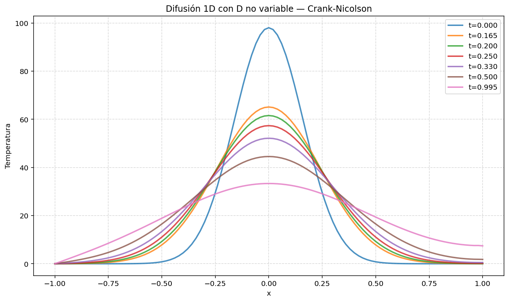
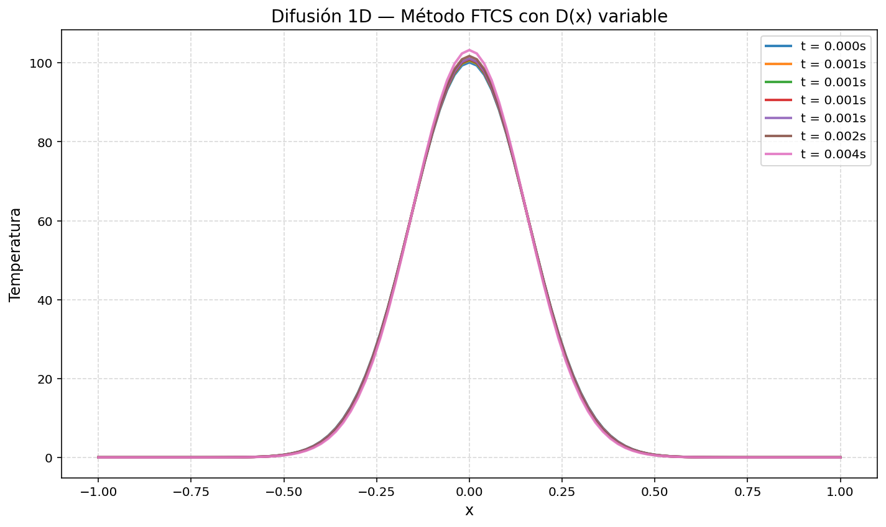
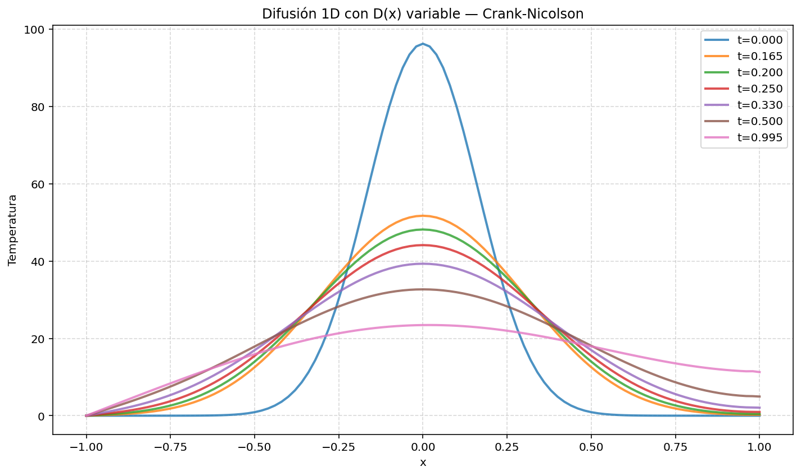
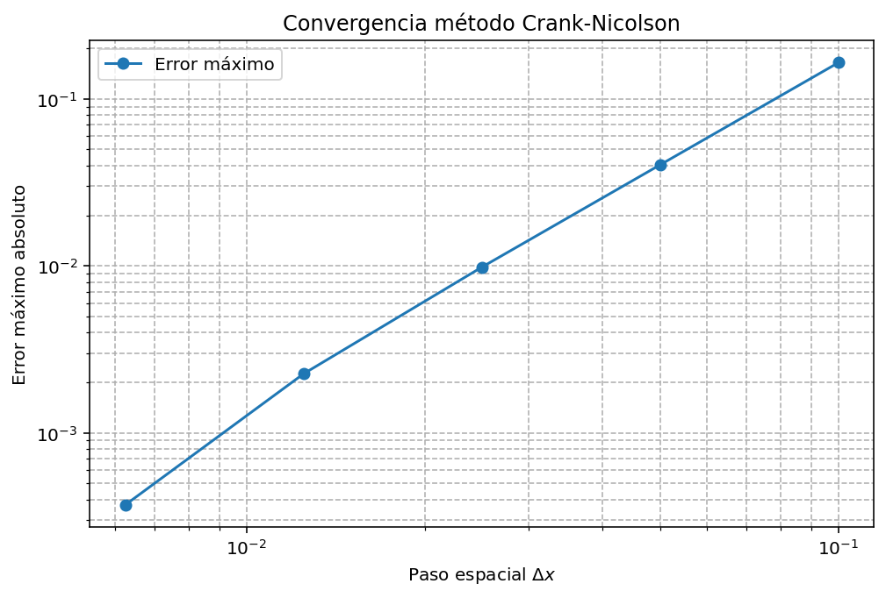
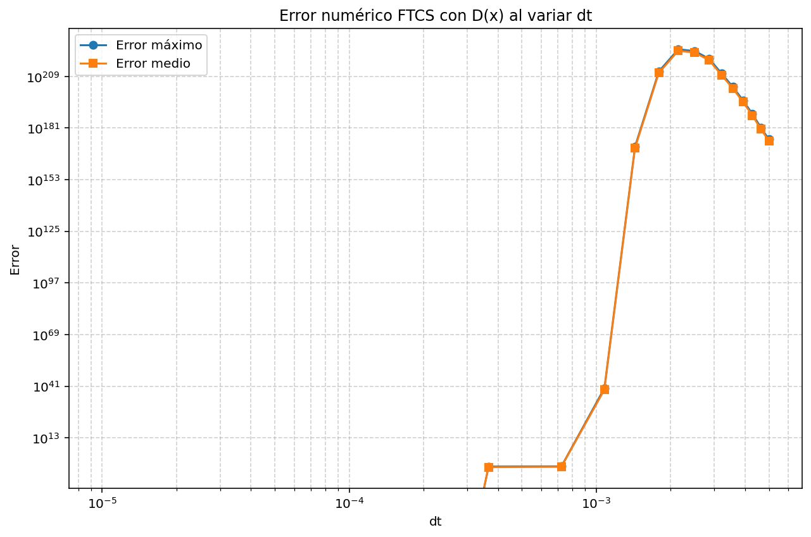
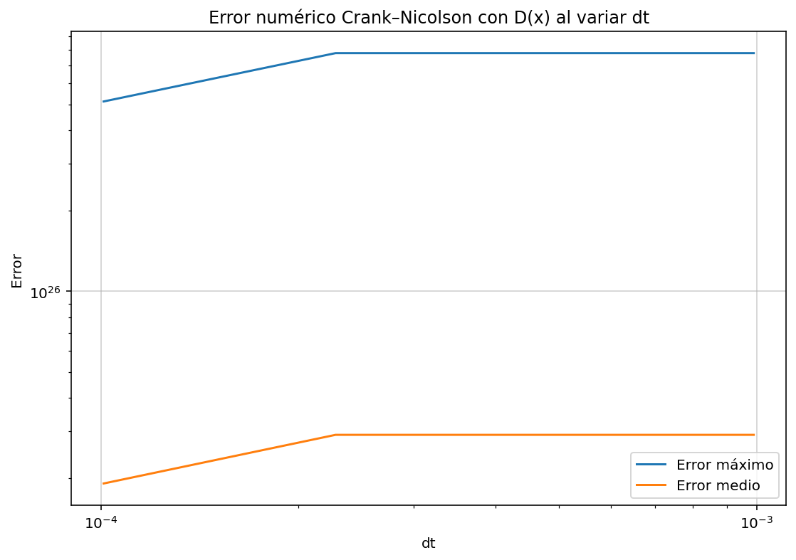
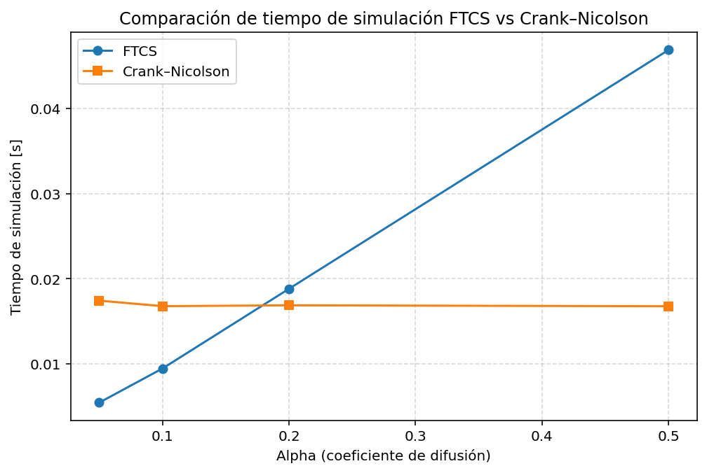

# Heat Equation Diffusion Solver: FTCS and Crank-Nicolson Methods

Numerical study of the one-dimensional heat equation using finite-difference methods. The project compares the explicit FTCS scheme and the Crank-Nicolson method for constant and spatially variable diffusion coefficients, with attention to stability, conservative discretization, numerical error and runtime.

This repository is a cleaned computational-physics portfolio version of a numerical modelling practice from my final year Physics degree at the University of Alicante.

---

## Scientific motivation

The heat equation is one of the standard models for diffusion and relaxation. It describes how an initially localized temperature distribution spreads over time as heat flows from hotter regions to colder regions.

The project is designed to show the full computational workflow: start from the physical PDE, derive finite-difference discretizations, implement explicit and implicit time integration, test stability and accuracy, compare constant and variable diffusion, and interpret numerical figures physically.

---

## Equation studied

For a constant diffusion coefficient, the one-dimensional heat equation is:

$$
\frac{\partial T}{\partial t}
=
D
\frac{\partial^2 T}{\partial x^2}.
$$

For spatially variable diffusion, the physically conservative form is:

$$
\frac{\partial T}{\partial t}
=
\frac{\partial}{\partial x}
\left(
D(x)
\frac{\partial T}{\partial x}
\right).
$$

The distinction is important. For variable diffusion, simply multiplying the standard Laplacian by $D(x)$ does not reproduce the full conservative operator.

---

## 1. Constant diffusion

The first tests use a constant diffusion coefficient. The initial condition is a localized Gaussian temperature profile. As time evolves, the peak decreases and the profile spreads.


The FTCS method reproduces the expected smoothing when the timestep satisfies the stability condition.



The Crank-Nicolson method produces the same physical diffusion behaviour while allowing a more robust implicit time evolution.

---

## 2. Variable diffusion

The project then considers spatially variable diffusion. This is more subtle because the correct equation is naturally written in conservative flux form.



The conservative discretization computes heat fluxes through interfaces between neighbouring grid cells.



The Crank-Nicolson variable-diffusion simulation combines a spatially heterogeneous diffusion coefficient with a more stable implicit time integrator.

---

## 3. Stability

FTCS is explicit and cheap per timestep, but conditionally stable. For the one-dimensional heat equation, the stability condition is:

$$
\frac{D\Delta t}{\Delta x^2}\leq\frac{1}{2}.
$$

For variable diffusion, the largest value of $D(x)$ controls the most restrictive stability condition:

$$
\Delta t
\leq
\frac{\Delta x^2}{2\max(D(x))}.
$$

Crank-Nicolson is unconditionally stable for the linear heat equation, but large timesteps can still reduce accuracy.



---

## 4. Error and runtime

A numerical method must be judged not only by visual behaviour, but also by error and computational cost.



The FTCS error plot illustrates how increasing timestep can degrade accuracy even before instability becomes visually obvious.



The Crank-Nicolson error plot highlights the difference between unconditional stability and actual accuracy.



The runtime comparison shows the practical trade-off between cheap explicit timesteps and more expensive implicit linear solves.

---

## Repository structure

```text
heat-equation-ftcs-crank-nicolson/
├── README.md
├── requirements.txt
├── .gitignore
├── src/
│   ├── heat_equation_ftcs_crank_nicolson.py
│   └── ftcs_matrix_helper.py
├── docs/
│   ├── theory.md
│   ├── numerical_method.md
│   ├── results_summary.md
│   └── sources_and_notes.md
├── figures/
│   ├── constant_diffusion/
│   ├── variable_diffusion/
│   ├── stability/
│   ├── error_analysis/
│   ├── runtime/
│   └── alpha_sweeps/
└── raw_upload/
```

---
