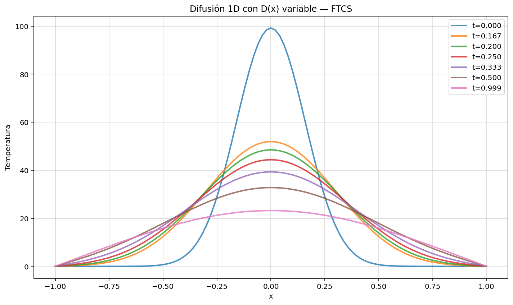
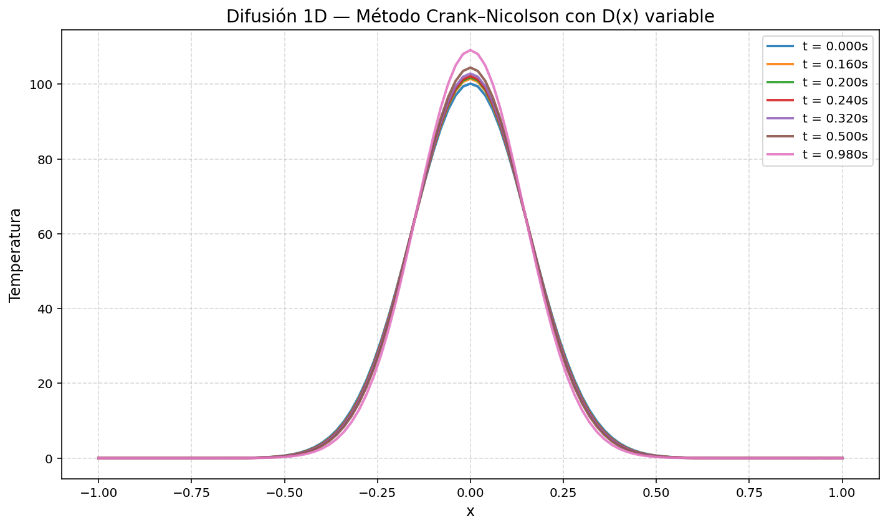
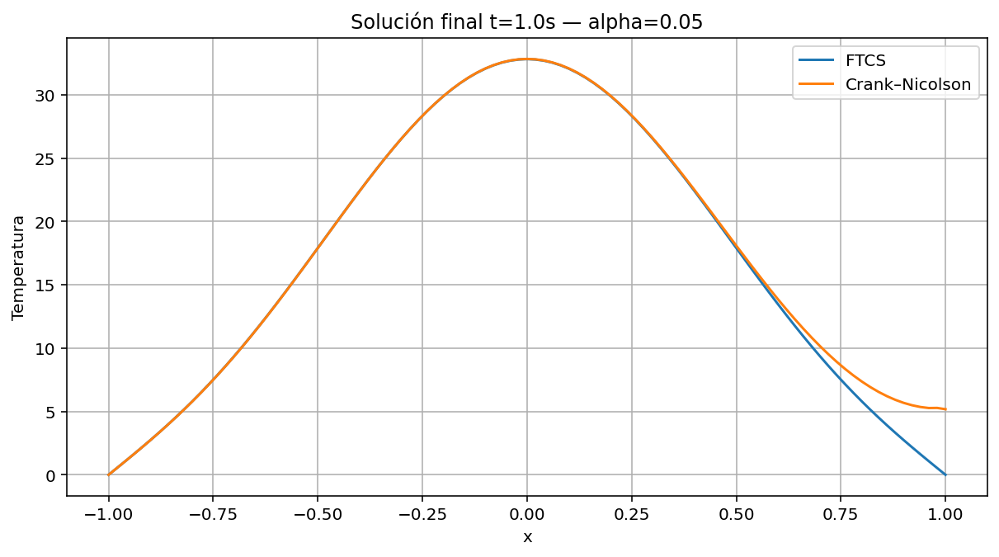
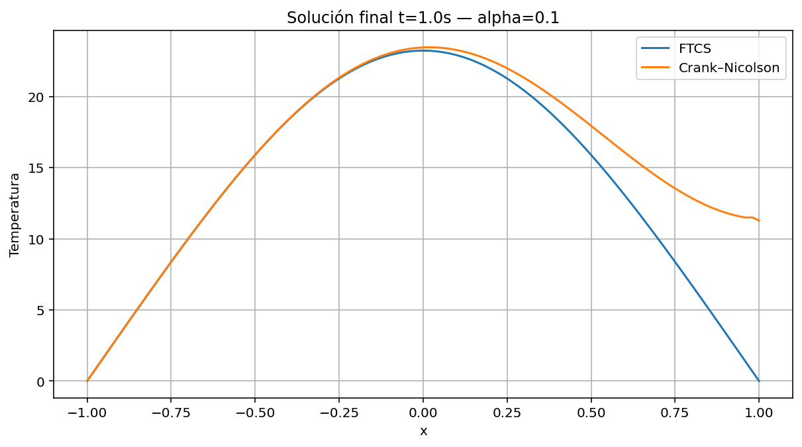
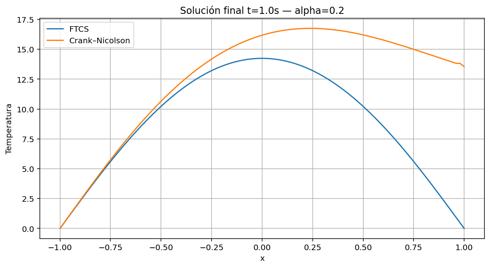
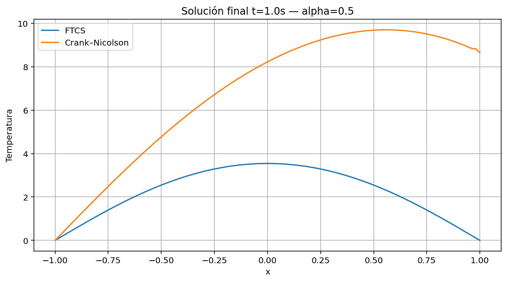

# Results Summary

This document analyses the numerical figures generated for the one-dimensional heat-equation diffusion project. The goal is not only to display the plots, but to interpret what each result says about diffusion physics, stability, accuracy, conservative discretization and computational cost.

---

## 1. Constant diffusion with FTCS

This figure shows the evolution of the temperature profile under the one-dimensional heat equation with constant diffusion coefficient using the FTCS method.

The initial condition is a localized Gaussian peak. As time increases, the profile becomes wider and lower. This is exactly the expected physical behaviour of the heat equation. The central region initially has the largest temperature, so heat flows away from the centre toward neighbouring colder regions. The curvature of the profile drives this evolution: near the peak, the second derivative is negative, so the temperature decreases; away from the peak, heat arriving from neighbouring points raises the temperature.

The FTCS update used for constant diffusion is:

$$
\begin{aligned}
T_j^{n+1}
&=
T_j^n
+
\frac{D\Delta t}{\Delta x^2}
\left(
T_{j+1}^n
-
2T_j^n
+
T_{j-1}^n
\right).
\end{aligned}
$$

A key point in interpreting the figure is stability. FTCS is conditionally stable, so the timestep must satisfy:

$$
\frac{D\Delta t}{\Delta x^2}\leq\frac{1}{2}.
$$

The smoothness of the plotted profiles indicates that the simulation is operating in a stable regime. There are no growing point-to-point oscillations, no alternating high-frequency instability, and no unphysical blow-up. The figure therefore validates both the physical behaviour of the heat equation and the basic FTCS implementation for the chosen timestep.

However, FTCS stability should not be confused with general robustness. The method works here because the timestep has been chosen according to the stability condition. If the timestep were increased too much, the same method would become unstable.

---

## 2. Constant diffusion with Crank-Nicolson

This figure shows the heat-equation evolution for constant diffusion using the Crank-Nicolson method. The physical trend is the same as for FTCS: the initial Gaussian peak spreads and its maximum decreases.

The Crank-Nicolson method solves:

$$
\left(
I-\frac{D\Delta t}{2}L
\right)
\mathbf{T}^{n+1}
=
\left(
I+\frac{D\Delta t}{2}L
\right)
\mathbf{T}^{n}.
$$

This method is implicit because the unknown future profile appears on the left-hand side inside a linear system. Its main advantage is stability. For the linear heat equation, Crank-Nicolson is unconditionally stable, meaning that it does not suffer from the same strict timestep stability limit as FTCS.

The plotted profiles should be interpreted as evidence that the implicit matrix formulation is correctly smoothing the temperature field. The curves remain smooth and bounded. The heat peak decays gradually rather than developing artificial oscillations.

The important comparison with FTCS is methodological. Both methods reproduce the qualitative physics for this case. The difference is that FTCS achieves this only under a restrictive timestep condition, while Crank-Nicolson can remain stable for larger timesteps. This advantage becomes more important for fine grids, large diffusion coefficients or longer final times.

---

## 3. First variable-diffusion FTCS attempt

This figure corresponds to a first attempt at including spatially variable diffusion in the FTCS framework.

A tempting but incomplete approach is to replace the constant coefficient $D$ by a local value $D(x)$ multiplying the usual Laplacian:

$$
D(x)\frac{\partial^2 T}{\partial x^2}.
$$

However, the physically correct equation for variable diffusion is:

$$
\frac{\partial T}{\partial t}
=
\frac{\partial}{\partial x}
\left(
D(x)
\frac{\partial T}{\partial x}
\right).
$$

These are not equivalent. Expanding the conservative form gives an additional term involving $dD/dx$. For this reason, the figure should not be presented as the final physically preferred model. Instead, it is useful pedagogically because it reveals why variable-coefficient diffusion must be handled more carefully than constant-coefficient diffusion.

The result may still show smoothing, but the numerical operator does not fully represent the correct flux balance. This distinction is important for scientific computing: a simulation can look plausible while still being based on an incomplete discretization of the physical equation.

---

## 4. Corrected conservative FTCS variable diffusion

This figure shows the corrected FTCS treatment of spatially variable diffusion using the conservative flux form.

The correct continuous equation is:

$$
\frac{\partial T}{\partial t}
=
\frac{\partial}{\partial x}
\left(
D(x)
\frac{\partial T}{\partial x}
\right).
$$

A conservative discretization evaluates diffusion at interfaces between grid cells:

$$
D_{j+1/2}
=
\frac{D_j+D_{j+1}}{2}.
$$

The discrete operator is:

$$
\begin{aligned}
\frac{1}{\Delta x^2}
\left[
D_{j+1/2}
\left(
T_{j+1}-T_j
\right)
-
D_{j-1/2}
\left(
T_j-T_{j-1}
\right)
\right].
\end{aligned}
$$

This figure is one of the most important results of the practice because it shows the corrected physical modelling of a variable diffusion coefficient. Instead of treating diffusion as a purely local multiplier of curvature, the conservative form computes heat transfer through interfaces. That is closer to the physical meaning of diffusion as a flux process.

The profile should still smooth over time, but the spatial variation of $D(x)$ changes the rate and shape of the smoothing. Regions with larger diffusivity relax faster, while regions with smaller diffusivity evolve more slowly. The figure therefore combines the basic heat-equation behaviour with a more realistic heterogeneous medium.

---

## 5. Variable diffusion with Crank-Nicolson

This figure shows a variable-diffusion simulation using the Crank-Nicolson method.

The result combines two important improvements: the diffusion coefficient varies in space and the time integration is implicit/semi-implicit. The spatial variation of $D(x)$ means that different parts of the domain conduct heat at different rates. The Crank-Nicolson method then evolves this system by solving a linear system at each timestep.

This is numerically more robust than FTCS, especially when the maximum value of $D(x)$ is large. For explicit FTCS, the stable timestep is limited by:

$$
\Delta t
\leq
\frac{\Delta x^2}{2\max(D(x))}.
$$

Crank-Nicolson avoids this strict stability restriction. The plotted profile should therefore be interpreted as a demonstration of a more stable method for variable-coefficient diffusion.

The physical expectation remains the same: temperature gradients are smoothed. The difference is that spatially variable diffusivity can make the smoothing non-uniform across the domain.

---

## 6. Additional Crank-Nicolson variable-diffusion profile

This additional Crank-Nicolson figure provides a complementary view of the variable-diffusion simulation.

If the figure shows profiles at different times, it should be interpreted as the gradual relaxation of the initial heat peak under a spatially heterogeneous diffusion coefficient. The central peak decreases, the profile broadens, and the fixed zero-temperature boundaries influence the long-time decay.

If the figure focuses on a final profile, it should be read as a summary of the accumulated diffusion process. A stronger flattening indicates more diffusion, while residual localization indicates slower relaxation.

---

## 7. Crank-Nicolson convergence

This figure is related to the numerical reliability of the Crank-Nicolson method.

Crank-Nicolson requires solving a linear system at every timestep:

$$
M_{\mathrm{left}}
\mathbf{T}^{n+1}
=
\mathbf{b}.
$$

The convergence or stability plot is important because it checks whether this implicit update behaves consistently over time. A well-behaved Crank-Nicolson simulation should not show runaway growth, uncontrolled oscillations, or numerical divergence.

The figure supports the theoretical expectation that Crank-Nicolson is stable for the linear heat equation. It also confirms that the matrix formulation has been implemented in a numerically reliable way.

However, this should not be interpreted as saying that any timestep is equally accurate. Crank-Nicolson is unconditionally stable, but large timesteps can still produce less accurate transient profiles. This distinction between stability and accuracy is one of the central messages of the practice.

---

## 8. Runtime comparison between FTCS and Crank-Nicolson

This figure compares the computational cost of FTCS and Crank-Nicolson.

FTCS is explicit. Each update is cheap because it only requires evaluating a local stencil or performing a matrix-vector operation. Crank-Nicolson is implicit and each timestep requires solving a linear system.

At first sight, FTCS might seem better because each step is faster. However, FTCS often requires many more steps due to its stability condition. Crank-Nicolson is more expensive per step, but it can often use larger timesteps.

The runtime comparison should therefore be interpreted as a trade-off. The best method depends on the grid spacing, diffusion coefficient, final simulation time, desired accuracy, linear solver efficiency and whether sparse matrices are used.

---

## 9. FTCS error versus timestep

This figure studies how the FTCS numerical error changes as the timestep varies.

For FTCS, the timestep is central because it controls both stability and accuracy. The stability parameter is:

$$
r=\frac{D\Delta t}{\Delta x^2}.
$$

For variable diffusion, the maximum value of $D(x)$ controls the most restrictive region:

$$
\Delta t
\leq
\frac{\Delta x^2}{2\max(D(x))}.
$$

The error plot should be read with this condition in mind. As $\Delta t$ increases, the numerical solution becomes less accurate. Even before a visible instability appears, the profile may deviate significantly from a reference solution.

This figure demonstrates that stability is necessary but not sufficient. A simulation can remain bounded and still have unacceptable error. For scientific computing, one must study convergence and accuracy, not only whether the code runs without blowing up.

---

## 10. Crank-Nicolson error versus timestep

This figure shows the error behaviour of Crank-Nicolson as the timestep changes.

Crank-Nicolson is second-order accurate in time for the linear heat equation. Therefore, as the timestep is refined, the error should decrease more efficiently than for a first-order time method.

The important point is that Crank-Nicolson is unconditionally stable, but not unconditionally accurate. A very large timestep may still produce a poor approximation of the transient evolution, even if the solution does not blow up.

This figure therefore reinforces the distinction between stability and accuracy. Stability tells us whether errors remain bounded. Accuracy tells us whether the computed solution is close to the true or reference solution.

---

## 11. Alpha sweep: physical interpretation

The alpha sweep studies a variable diffusion coefficient of the form:

$$
D(x)=\alpha
\left(
1+e^{-x^2}
\right).
$$

The parameter $\alpha$ controls the global strength of diffusion. Increasing $\alpha$ increases the diffusion coefficient across the domain.

Physically, larger $\alpha$ means faster heat spreading. The Gaussian peak should flatten more quickly, and the temperature profile should become smoother in less time.

Numerically, larger $\alpha$ also makes explicit FTCS more restrictive. Since the stable timestep scales as:

$$
\Delta t
\leq
\frac{\Delta x^2}{2\max(D(x))},
$$

larger $\alpha$ means smaller stable $\Delta t$.

### Alpha = 0.05, short time

For a small value of $\alpha$ and short final time, the profile should remain relatively close to the initial Gaussian. Diffusion has begun, but the central peak should still be clearly visible.

### Alpha = 0.1, short time

Increasing $\alpha$ to 0.1 strengthens diffusion. At the same final time, the profile should be slightly flatter and broader than for $\alpha=0.05$.

### Alpha = 0.05, long time

At longer time, even a small diffusion coefficient has had more time to act. The central peak should be lower than in the short-time case, and the heat should have spread farther across the domain.

### Alpha = 0.1, long time

For $\alpha=0.1$ at long time, the smoothing should be stronger than for $\alpha=0.05$. The central peak should be further reduced, and the profile should be broader.

### Alpha = 0.2, long time

For $\alpha=0.2$, diffusion is stronger. The long-time profile should be substantially smoother. Depending on the boundary conditions, much of the heat may have moved toward the boundaries and been absorbed by the zero-temperature reservoirs.

### Alpha = 0.5, long time

This is the strongest diffusion case in the sweep. The profile is expected to be the most flattened and most strongly decayed. Numerically, this is also the most restrictive case for FTCS because $\max(D(x))$ is largest.

---

## 12. Overall conclusions from the figures

The figures support the following conclusions:

1. The heat equation smooths temperature gradients over time.
2. A localized Gaussian peak becomes wider and lower as diffusion proceeds.
3. FTCS reproduces the expected behaviour when the timestep satisfies the stability condition.
4. FTCS is computationally simple but strongly limited by $\Delta t\propto\Delta x^2$.
5. Crank-Nicolson reproduces the diffusion process while being much more stable for larger timesteps.
6. Variable diffusion requires conservative flux discretization for physical consistency.
7. Simply multiplying the standard Laplacian by $D(x)$ is not the full variable-diffusion operator.
8. Runtime comparisons are essential because explicit and implicit methods have different cost structures.
9. Error-versus-timestep plots show that stability is not the same as accuracy.
10. Increasing $\alpha$ increases both the physical diffusion rate and the numerical stiffness of explicit FTCS.

Overall, the project demonstrates the full workflow of computational physics: start from a physical PDE, choose a discretization, analyse stability, implement the method, generate numerical results, and interpret those results in terms of both physics and computation.
